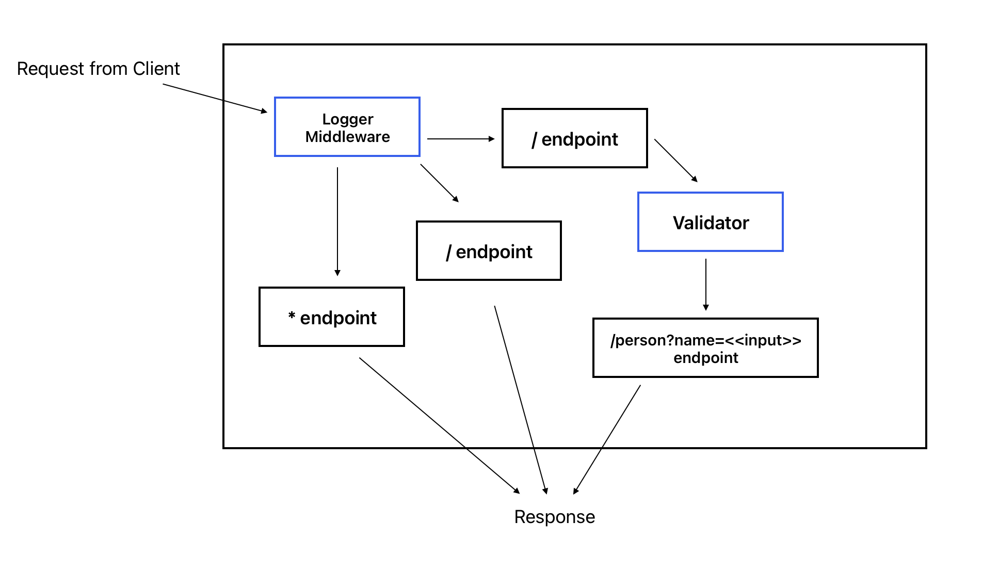

# LAB 02 - Express

## Project: Express and Deployment

### Author: Francisco

### Problem Domain

Basic API Server where we write some middleware and practice deployment. Focus also on integration of testing suites. .

### Links and Resources

- [GitHub Actions ci/cd](https://github.com/c0d3cisco/basic-express-server/actions)
- [back-end prod server url](https://basic-express-server-lab02.onrender.com)

## Collaborators

Code was written while Ryan Gallaway taught a class for Express.

### Setup

#### `.env` requirements (where applicable)

port variable exists within the env sample

#### How to initialize/run your application (where applicable)

clone repo, `npm install`, then run `nodemon` in the terminal

#### Routes

- GET : `/` - specific route to hit
- GET : `/person?name=<<value>>` - specific route to hit, must include key/value pair
- GET : `*` - specific route to hit

#### Tests

to run tests, after running `npm i`, run the command `npm test`

#### UML

